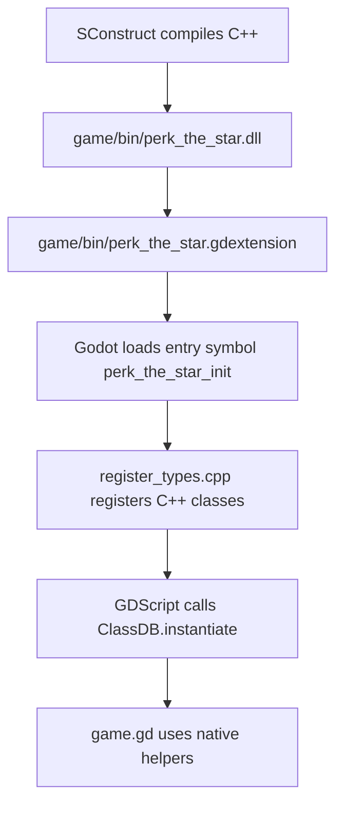
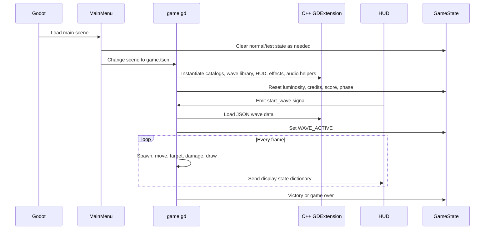
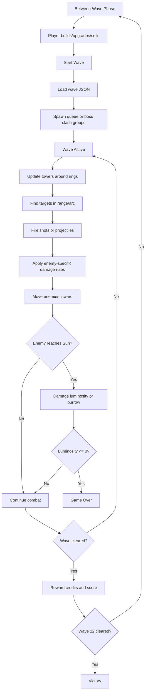
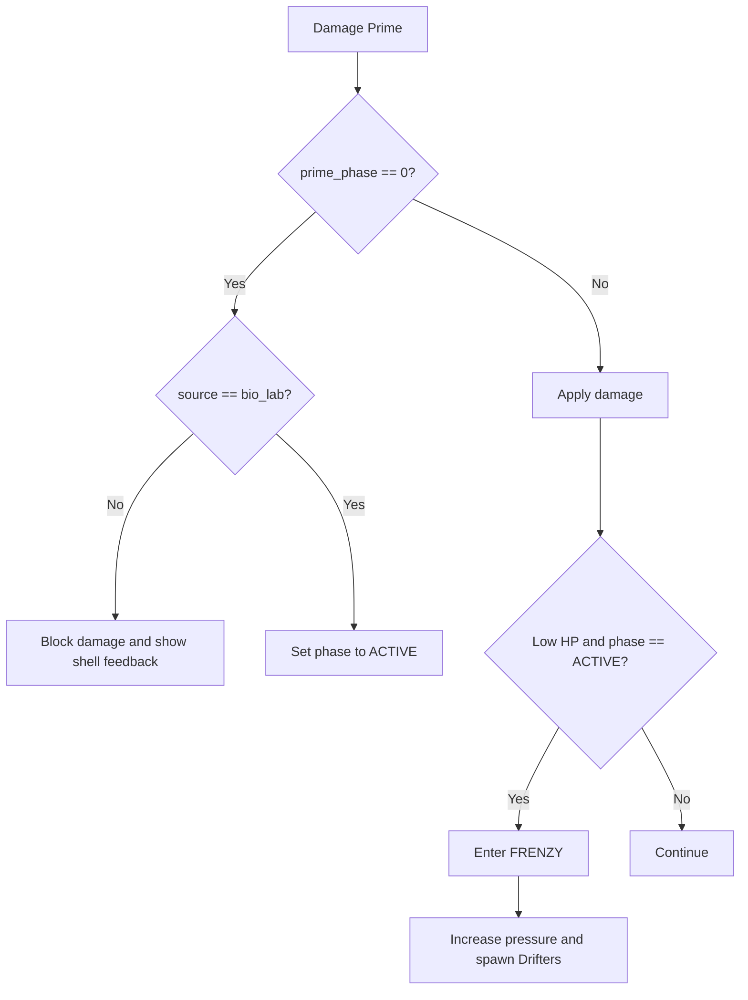

# Perk the Star Code Logic And Presentation Guide

This guide answers the questions most likely to appear during a code defense or live demo.

## Short Technical Summary

The game is a Godot 4.6 project. Godot owns the actual executable entry point, `project.godot` opens the main scene, C++ classes are loaded through GDExtension, and `scripts/game/game.gd` coordinates the live gameplay loop.

## Where Is The Main Function?

There is no project-owned `int main()` because Godot is the engine executable. In Godot projects, the equivalent entry path is:

```text
project.godot -> run/main_scene -> scenes/main_menu.tscn
```

The C++ extension entry point is:

```cpp
extern "C" {
GDExtensionBool GDE_EXPORT perk_the_star_init(
    GDExtensionInterfaceGetProcAddress p_get_proc_address,
    GDExtensionClassLibraryPtr p_library,
    GDExtensionInitialization* r_initialization)
}
```

This function is in `gdextension/src/register_types.cpp`. It registers the native classes with Godot through `ClassDB::register_class<T>()`.

The gameplay "main loop" is in:

```text
scripts/game/game.gd
```

Important functions:

| Function | Purpose |
|---|---|
| `_ready()` | Initializes native helpers, loads assets, connects signals, resets state. |
| `_process(delta)` | Per-frame gameplay update. |
| `_unhandled_input(event)` | Keyboard/mouse gameplay input. |
| `_draw()` | Draws the board, towers, enemies, effects, banners, and overlays. |
| `_on_start_wave_pressed()` | Handles Start Wave button and Wave 12 briefing gate. |
| `_begin_wave()` | Starts the loaded wave and sets wave state. |
| `_spawn_enemy()` | Creates enemy dictionaries from catalog data. |
| `_process_towers()` | Moves towers and fires when ready. |
| `_process_enemies()` | Moves enemies, applies Sun damage, handles breaches. |
| `_damage_enemy()` | Applies damage and special enemy rules. |
| `_trigger_solar_flare()` | Applies radial Solar Flare damage and visual effects. |

## How Are C++ And GDScript Connected?

The connection is Godot GDExtension.



Example pattern in `game.gd`:

```gdscript
var game_catalog: RefCounted = ClassDB.instantiate("GameCatalogNative") as RefCounted
```

The C++ side exposes methods with:

```cpp
ClassDB::bind_method(D_METHOD("load_wave", "wave_number"), &GameWaveLibraryNative::load_wave);
```

After binding, GDScript can call:

```gdscript
wave_library.call("load_wave", wave_number)
```

## Implementation Sequence

The runtime sequence is:



## Why Is It Not Fully C++?

It is not fully C++ because Godot scene work is cleaner in GDScript. Input, signals, scene changes, drawing calls, dictionaries, and UI coordination are native to Godot's scripting layer, so keeping `game.gd` as the coordinator makes the project easier to debug and present.

C++ is still used where it helps most:

- Catalog data and constants.
- Wave loading and wave intel formatting.
- Orbit math.
- Tower stat and upgrade calculations.
- HUD layout and UI signals.
- Settings overlay logic.
- SFX bus and effect storage.
- Global game state.

The split is intentional:

```text
GDScript = scene flow, input, drawing, orchestration
C++ = reusable systems, data helpers, UI classes, math, state, audio
```

## Did You Use AI?

Yes, AI assistance was used as a development helper for code review, debugging, documentation, and iteration support. The team still owns the design, testing, integration, and presentation understanding. In defense, the honest answer is:

> We used AI as an assistant, like a pair programmer and documentation helper. We reviewed the code, tested it in Godot, and made sure we understood how the systems connect.

## Why This Game?

This game was chosen because orbital tower defense gives a clear technical challenge and a memorable presentation hook. It combines:

- Real-time gameplay.
- Resource management.
- Enemy variety.
- Geometry and orbital motion.
- Data-driven waves.
- UI and feedback systems.
- C++ and GDScript integration.

It is also easy to demo quickly: build a tower, start a wave, show orbiting fire, then show the boss/test wave tools.

## What Is An Astrophage?

In the game, Astrophage are alien microorganisms that feed on stellar energy. They are inspired by `Project Hail Mary`, but adapted into game enemies. Each variant teaches a different counter:

| Astrophage | Meaning In Gameplay |
|---|---|
| Drifter | Basic enemy. |
| Bloom | Splits into smaller enemies. |
| Burrower | Reaches the Sun and drains it over time. |
| Mimic | Punishes Photon-only builds. |
| Farmer | Absorbs energy damage and grows stronger. |
| Prime | Final boss that tests all systems. |

## Where Do The Effects Come From?

Effects come from a mix of sprite assets, drawing code, audio files, and native helper systems.

| Effect | Source |
|---|---|
| Enemy sprites | `assets/sprites/clean/enemies/` and `assets/sprites/clean/enemies_optimized/` |
| Tower sprites | `assets/sprites/clean/towers/` |
| Backgrounds | `assets/sprites/backgrounds/` |
| HUD theme | `SpaceThemeNative`, `GameHudNative`, `HudPanelFxNative` |
| Shots and flashes | `scripts/game/game.gd` drawing functions and `GameEffectStoreNative` |
| Sol counter shake/red flash | `GameHudNative::play_insufficient_sol_feedback()` |
| Wave banners | `_show_wave_banner()` and `_draw_wave_banner()` in `game.gd` |
| Prime briefing popup | `_draw_prime_briefing()` in `game.gd` |
| Solar Flare visual | `_trigger_solar_flare()` and `_draw_visual_effects()` in `game.gd` |
| Audio/SFX | `assets/audio/sfx/`, `assets/audio/bgm/final/`, `GameSfxBusNative`, `MusicManagerNative` |

## Main Gameplay Logic



## Tower Logic

Towers are stored at runtime as dictionaries in the `towers` array. Each tower tracks:

- Tower type.
- Ring index.
- Slot index.
- Current orbital angle.
- Fire timer.
- Upgrade level.
- Sol spent.

The formula for position is:

```latex
\theta_{new} = \theta_{old} + \omega \Delta t
```

```latex
position = sun + (r\cos\theta, r\sin\theta)
```

The tower update sequence is:

```text
update angle -> compute position -> find best target -> check cooldown -> fire -> reset timer
```

## Enemy Logic

Enemies are stored at runtime as dictionaries in the `enemies` array. Each enemy tracks:

- Variant.
- Position and velocity.
- HP and max HP.
- Speed.
- Damage.
- Reward.
- Radius and draw size.
- Status timers.
- Prime phase, if the enemy is Prime.

Enemy base stats come from `GameCatalogNative::enemy_configs()`. Special rules are handled in `game.gd`, especially inside damage, death, burrower, farmer, mimic, and Prime functions.

## Prime Logic

Prime uses `prime_phase`:

| Phase | Value | Behavior |
|---|---:|---|
| Shell | 0 | Blocks normal damage. Bio-Lab opens it. |
| Active | 1 | Takes full damage. |
| Frenzy | 2 | Moves faster and spawns Drifters while alive. |

Prime damage flow:



## Sol Credits Logic

Credits are stored in `GameStateNative::sol_credits`.

Normal spending:

```cpp
if (sol_credits < amount) {
    return false;
}
sol_credits -= amount;
emit_signal("credits_changed", sol_credits);
return true;
```

When spending fails, `game.gd` calls the HUD feedback function, and the Sol counter shakes and flashes red.

Test mode spending:

```cpp
if (test_unlimited_sol_enabled) {
    emit_signal("credits_changed", sol_credits);
    return true;
}
```

This makes the secret test wave mode useful for demonstrations without changing normal gameplay.

## Solar Flare Logic

The flare normally charges after every three cleared waves:

```text
clear wave -> waves_since_last_flare += 1 -> if 3 then flare_charge = 1
```

During an active wave, pressing `F` calls `_try_manual_flare()`. If charged, `_trigger_solar_flare()` damages enemies near the Sun and creates flare visuals and sounds.

In test wave mode, `GameStateNative::try_trigger_flare()` always returns true, so Solar Flares are infinite only during that testing state.

## Settings And Test Wave Logic

The settings overlay includes a `TEST WAVE` button. It opens a themed popup, asks for the secret code, then asks which wave to start.

Secret code:

```text
dexterbayot
```

After the code is accepted:

```text
SettingsOverlayNative -> GameState.enable_test_run(wave) -> change_scene_to_file(game.tscn)
```

When `game.gd` loads, it consumes the pending test wave and sets:

```text
GameState.current_wave = selected_wave - 1
```

The wave does not start immediately. The player still clicks Start Wave, which is better for setup and presentation.

## Sequence When Playing The Game

1. Open the project root in Godot.
2. Run `project.godot`.
3. Main menu appears.
4. Click `Play`.
5. Game scene loads.
6. Select a tower from the Tower Bay or press number keys `1` to `6`.
7. Click an orbital slot to build.
8. Click `Start Wave`, or press `Space`/`Enter`.
9. Enemies spawn from wave JSON.
10. Towers orbit and fire automatically.
11. Earn Sol Credits by killing enemies and clearing waves.
12. Upgrade or sell towers during or between waves.
13. Press `F` when Solar Flare is ready.
14. Survive until Wave 12.
15. For Wave 12, read the Prime popup, then begin the boss wave.
16. Clear Prime and remaining enemies to reach victory.

## How To Demo

Use this short demo route:

1. Start at the main menu and point out the title, command phrase, and sci-fi UI.
2. Press `Play`.
3. Build a Photon Splitter on Ring 1 to show orbital placement.
4. Start Wave 1 and show towers rotating while firing.
5. Try to buy something too expensive to show the Sol Credit shake/red feedback.
6. Upgrade or sell a tower to show mid-wave management.
7. Open Settings, use `TEST WAVE`, enter `dexterbayot`, and choose Wave 12.
8. Explain that test mode gives unlimited Sol Credits and infinite Solar Flares only for testing.
9. Click Start Wave and show the Prime briefing popup.
10. Confirm the popup and point out the `ASTROPHAGE PRIME IS COMING` warning.
11. Show Prime shell, Bio-Lab shell break, active phase, and frenzy pressure.
12. End by showing either victory rank or the game-over screen.

## Quick Defense Answers

| Question | Answer |
|---|---|
| Where is your main function? | Godot owns `main`; our entry path is `project.godot`, and the C++ extension entry is `perk_the_star_init` in `register_types.cpp`. |
| Where is the main gameplay loop? | `_process(delta)` in `scripts/game/game.gd`. |
| How are C++ and GDScript connected? | Through GDExtension, `ClassDB::register_class`, `ClassDB::bind_method`, and `ClassDB.instantiate`. |
| Why not fully C++? | Godot scene flow, signals, input, and drawing are faster and clearer in GDScript; reusable helpers are in C++. |
| Did you use AI? | Yes, as an assistant for iteration and documentation, while the team reviewed, tested, and integrated the work. |
| Why this game? | It demonstrates real-time logic, geometry, UI, data-driven design, resource management, and engine/native integration. |
| What is Astrophage? | A fictional stellar-energy-feeding microorganism adapted into enemy variants. |
| Where are effects from? | Sprites/audio in `assets/`, drawing in `game.gd`, HUD/theme/effect helpers in C++. |
| What does SCons do? | It compiles the C++ GDExtension DLL that Godot loads. |
| How do waves work? | `GameWaveLibraryNative` reads JSON files from `data/waves/` and `game.gd` spawns enemies from the normalized data. |
