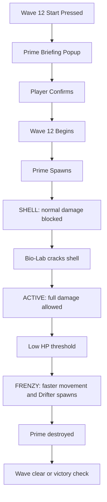
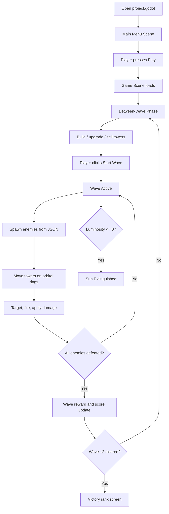
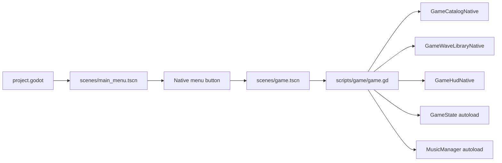

# Perk the Star Final Updated Proposal

**Group H | CMSC 21-A**  
**Developers:** Geo Ceff Gabaisen and Dexter Juevesano  
**Instructor:** Ryan Ciriaco Dulaca  
**Current implementation:** Godot 4.6, GDScript, and C++ GDExtension  
**Command phrase:** Defend me, defend me! - Oa ka Perk!

## Executive Summary

`Perk the Star` is a single-player real-time orbital tower defense game where the player commands the Sol Defense Corps and protects the Sun from Astrophage, extraterrestrial photosynthetic microorganisms that feed on stellar energy. The original proposal described a C++ and SFML implementation. The current playable build keeps the same core proposal idea, but upgrades the implementation to Godot 4.6 with C++ GDExtension systems for reusable native logic and GDScript for scene orchestration.

The central innovation remains orbital placement. Towers are built on four rotating rings around the Sun. Since every tower moves continuously, the player is not only choosing a tower type and slot, but also timing engagement arcs as enemies drift inward. The Sun is both the protected entity and the emotional center of the game: if luminosity reaches zero, the run ends.

## Proposal-To-Implementation Update

| Area | Original Proposal | Final Current Build |
|---|---|---|
| Engine | C++ with SFML | Godot 4.6 with C++ GDExtension |
| Main gameplay coordinator | C++ game loop | `scripts/game/game.gd` |
| Native logic | SFML-facing structs/classes | Registered C++ Godot classes in `gdextension/src/` |
| Wave data | External JSON planned | `data/waves/wave_01.json` through `wave_12.json` |
| UI | Basic title/game screens | Main menu, HUD, pause, codex, settings, tutorial, test wave panel |
| Art direction | Pixel-art cozy crisis | Dark sci-fi operations UI with clean enemy/tower sprites |
| Towers | Six planned towers | Six playable towers with build, upgrade, sell, preview, and HUD cards |
| Enemies | Astrophage variants planned | Drifter, Bloom, Coronal Burrower, Photon Mimic, Solar Farmer, Astrophage Prime |
| Boss | Prime planned | Wave 12 Prime with shell, active, frenzy, warning banner, and briefing popup |
| Economy feedback | Not specified | Sol counter shakes and turns red when the player lacks credits |
| Testing tools | Not specified | Secret settings test wave mode with unlimited Sol Credits and infinite Solar Flares |
| Audio | Not detailed | Menu, wave, boss, ending music, and SFX bus |
| Build system | C++ compiler assumed | `SConstruct` builds `game/bin/perk_the_star.dll` |

## Narrative

Seventeen months ago, astronomers detected a small anomaly in the Sun's luminosity. Six months ago, it became severe. Now the Sun is being consumed by Astrophage. The player is the Sol Commander, responsible for using Sol Credits, orbital towers, and Solar Flares to survive twelve escalating waves.

Astrophage are alien microorganisms inspired by the premise of `Project Hail Mary`. In the game, they behave as hostile stellar parasites: they move inward, mutate into variants, and force the player to adapt.

## Game Entities

| Entity | Description |
|---|---|
| Sun | Protected core and health system. Luminosity ranges from 0 to 100 percent. |
| Sol Commander | Player role. Builds, upgrades, sells, starts waves, and triggers Solar Flares. |
| Orbital Towers | Player defenses placed on rotating ring slots. |
| Astrophage | Enemy collective that drains the Sun by reaching the corona. |
| Astrophage Prime | Wave 12 boss with shell, active, and frenzy phases. |
| Sol Credits | Resource used for towers, upgrades, and special actions. |
| Solar Flare | Charged radial attack from the Sun, manually triggered with `F`. |

## Core Statistics

| Stat | Range | Purpose |
|---|---:|---|
| Luminosity | $0 \le L \le 100$ | Sun health. Reaching $L = 0$ causes game over. |
| Sol Credits | $0 \le C$ | Economy for tower construction and upgrades. |
| Flare Charge | $0$ or $1$ | Determines whether a Solar Flare can fire. |
| Performance Score | $0 \le S$ | Tracks kills and run quality. |
| Current Wave | $1$ to $12$ | Campaign progress. |

## Orbital Mechanics

Towers occupy fixed slots on four concentric rings, but the rings rotate continuously. Each tower position is computed through polar-to-Cartesian conversion:

```latex
x = x_{\text{sun}} + r \cos(\theta)
```

```latex
y = y_{\text{sun}} + r \sin(\theta)
```

The angular velocity is computed from ring period:

```latex
\omega = \frac{2\pi}{T}
```

This means smaller rings rotate faster, while outer rings create longer but slower engagement windows.

| Ring | Radius | Period | Slots | Best Use |
|---|---:|---:|---:|---|
| Corona Belt | 80 px | 6 s | 4 | Photon Splitter, Helios Cannon |
| Chromosphere Band | 140 px | 11 s | 6 | Cryo Probe, Tardigrade Bomb |
| Photosphere Arc | 210 px | 17 s | 8 | Bio-Lab Station, Magnetic Net |
| Outer Veil | 290 px | 26 s | 10 | Early intercept and long coverage |

## Tower System

| Tower | Role | Implementation Notes |
|---|---|---|
| Photon Splitter | Early steady DPS | Fast and cheap, but weak against Mimics and Farmers. |
| Cryo Probe | Slow/control | Reduces enemy speed and supports burst towers. |
| Bio-Lab Station | Special counter | Excavates Burrowers and opens Astrophage Prime shell. |
| Magnetic Net | Crowd control | Groups and slows enemies for better burst windows. |
| Helios Cannon | Heavy burst | High cost, strong damage, dangerous against Solar Farmers. |
| Tardigrade Bomb | Finisher/AOE | Slow projectile that works best against slowed clusters. |

Tower costs and upgrade costs are stored in `GameStateNative`, while tower display data and stat calculations are prepared by `GameTowerLibraryNative`. The active tower sprites are stored in `assets/sprites/clean/towers/`.

## Astrophage Variants

| Variant | Role | Special Behavior |
|---|---|---|
| Drifter | Baseline enemy | Moves inward and teaches pacing. |
| Bloom | Splitter | Spawns Drifters when destroyed. |
| Coronal Burrower | Sun pressure | Burrows into the Sun and drains luminosity until Bio-Lab clears it. |
| Photon Mimic | Counter enemy | Ignores Photon Splitter damage and forces tower diversity. |
| Solar Farmer | Absorber | Feeds on energy damage, gaining health and speed. |
| Astrophage Prime | Boss | Shell blocks normal fire, Active is vulnerable, Frenzy accelerates and spawns Drifters. |

Astrophage base data is centralized in `GameCatalogNative::enemy_configs()`. Wave warnings and counter hints are generated by `GameWaveLibraryNative`.

## Astrophage Prime Update

Wave 12 now has extra presentation and gameplay clarity:

- Before Wave 12 begins, a themed popup explains Prime phases.
- A large warning says `ASTROPHAGE PRIME IS COMING`.
- Prime shell, active, and frenzy animation frames are routed through optimized enemy sprite paths.
- Prime active and frenzy draw direction is cleaned so the sprite faces its movement more clearly.
- Prime phase state changes affect animation state, HUD tags, and gameplay behavior.

Prime flow:



## Wave Progression

The campaign uses twelve JSON-authored waves in `data/waves/`.

| Wave | Name | Main Feature |
|---:|---|---|
| 1 | First Contact | Drifters and basic building. |
| 2 | The Vanguard | Credits and upgrades. |
| 3 | Splitting Point | Bloom split behavior. |
| 4 | Going Under | Burrower pressure and Bio-Lab importance. |
| 5 | Invisible Hand | Mimic counterplay. |
| 6 | Solar Storm | Auto flare and Cryo disruption event. |
| 7 | Night Side | Ring blind event. |
| 8 | The Harvest | Solar Farmer absorption. |
| 9 | Feeding Frenzy | Mixed swarm density. |
| 10 | Research Surge | Bio-Lab boost event. |
| 11 | Penultimate | Final mixed pressure. |
| 12 | Astrophage Prime | Boss wave with Prime phases and frenzy. |

## Game Flow



## Runtime Implementation Flow



## Major Source Files And Classes

| File/Class | Purpose |
|---|---|
| `project.godot` | Project entry, main scene, autoload registration, window settings. |
| `scripts/game/game.gd` | Main gameplay coordinator: input, spawning, combat, drawing, events, HUD sync. |
| `register_types.cpp` | Registers all C++ classes with Godot. |
| `game/bin/perk_the_star.gdextension` | Tells Godot to load `perk_the_star_init` from the DLL. |
| `GameStateNative` | Global phase, luminosity, credits, score, waves, settings, test mode. |
| `GameCatalogNative` | Towers, enemies, rings, constants, active sprite paths. |
| `GameWaveLibraryNative` | JSON wave loading, spawn queue, wave intel, warning tags. |
| `GameHudNative` | Native HUD layout, signals, labels, Sol feedback, end cards. |
| `GameOrbitMathNative` | Slot angles, ring radii, tower positions, nearest-slot logic. |
| `GameTowerLibraryNative` | Tower cost, stat, upgrade, refund, and management-card data. |
| `GameEffectStoreNative` | Temporary shots, flashes, floating text, and visual effects. |
| `GameSfxBusNative` | SFX playback and fallback sound generation. |
| `MusicManagerNative` | Menu music persistence and playback. |
| `SettingsOverlayNative` | Settings UI, audio controls, game feel, and secret test wave mode. |

## Implemented User-Facing Features

- Playable twelve-wave campaign.
- Orbital tower placement on four rings with 28 total slots.
- Six tower types with upgrades, selling, previews, and management panel.
- Six Astrophage variants plus the Wave 12 Prime boss.
- Wave Intel panel with contact count, reward, tags, and counter hints.
- Solar Flare triggered with `F` when charged.
- Main menu, pause menu, settings, codex, tutorial, victory, and game-over UI.
- Camera pan, zoom, edge scroll, and center-Sun controls.
- Music and SFX with saved settings.
- Screen shake setting.
- Auto Start Waves setting.
- Secret test wave mode using code `dexterbayot`.
- Test wave mode grants unlimited Sol Credits and infinite Solar Flares.
- Sol Credit counter shakes and flashes red when purchases fail.
- Wave 12 Prime briefing popup and warning banner.

## Build System

The project uses SCons to compile the C++ GDExtension into the DLL that Godot loads.

```powershell
scons platform=windows target=template_debug arch=x86_64
```

SCons reads `SConstruct`, compiles every `.cpp` file under `gdextension/src/`, links against `godot-cpp`, and outputs:

```text
game/bin/perk_the_star.dll
```

Godot loads it through:

```text
game/bin/perk_the_star.gdextension
```

The configured entry symbol is:

```text
perk_the_star_init
```

## End States

| Ending | Condition |
|---|---|
| Full Shine | Clear all waves with luminosity above 80 percent. |
| Bright | Clear all waves with luminosity above 60 percent. |
| Dim But Alive | Clear all waves with luminosity above 20 percent. |
| Last Light | Clear all waves with luminosity above 0 percent. |
| Sun Extinguished | Luminosity reaches 0 percent at any time. |

## Conclusion

The final build keeps the proposal's core identity: orbital tower defense, Astrophage pressure, Sol Credits, Solar Flares, and the Sun as the protected heart of the game. The implementation evolved from an SFML-only plan into a Godot 4.6 game with C++ GDExtension support, giving the project stronger UI, cleaner scene flow, easier wave tuning, and a more complete presentation-ready prototype.
